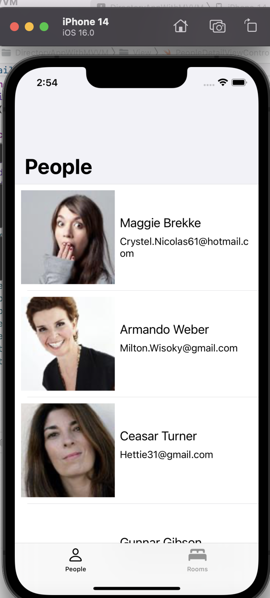

The Directory App is basically an App to keep info of their employees and rooms slots available. The app has two tabs 'People' and 'Rooms'. The People tab includes the list of all employees and the details of the each employee. The rooms tab just includes the list of rooms with no detail pages.

I've developed this app in MVVM. Developed this in Xcode version 14. I've implemented accesiblity features in the app for voice over, implemented localization for german language, used swiftlint for writing clean code. I've used custom image caching to cache images. I've performed error handling in app by making a separate error handling class for Networks. Made two different models for People and Rooms and a protocol for network manager. I've developed the UI in programmatic approach. I've written the test cases for the of People and Rooms module's Network Manager', for Image caching

## Screenshot

